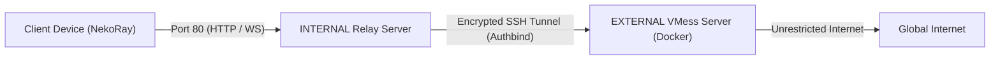

# Anti-Censorship VMess + SSH Relay Server Setup (Dual-Server Architecture)

A resilient, two-tier proxy architecture designed to circumvent national firewalls and deep
packet inspection (DPI) in heavily censored regions.

---

## Architecture Overview

1. **INTERNAL Server**: Located inside the restricted national boundary. It possesses
   unrestricted outbound connectivity to the international internet, acting as an domestic
   gateway relay.
2. **EXTERNAL Server**: Located in the free internet outside the restricted country, running
   the V2Ray / VMess Docker service.



---

## Prerequisites (Both Servers)

Run with a non-root sudoer user on both servers:

```bash
# Ensure user is in sudo group:
sudo adduser <USER_NAME> sudo

# Install basic networking and firewall tools:
sudo apt update && sudo apt install -y net-tools ufw
```

---

## Step 1: Prepare the INTERNAL Server (Authbind & SSH Relay)

Install `authbind` to allow non-root users to bind low privileged ports (e.g., port 80):

```bash
sudo apt-get install -y authbind

# Configure authbind for target relay port (e.g. 80):
sudo touch /etc/authbind/byport/<INTERNAL_PORT>
sudo chmod 755 /etc/authbind/byport/<INTERNAL_PORT>
sudo chown $(whoami):$(whoami) /etc/authbind/byport/<INTERNAL_PORT>
```

Verify that the target port is free:

```bash
sudo netstat -ano -p tcp | grep <INTERNAL_PORT>
```

_(If Nginx or another service binds this port, disable or remove it:
`sudo apt remove nginx && sudo apt autoremove`)_.

Configure firewall on INTERNAL server:

```bash
sudo ufw allow OpenSSH
sudo ufw allow <INTERNAL_PORT>
sudo ufw enable
```

---

## Step 2: Prepare the EXTERNAL Server (V2Ray Docker Stack)

1. Install Docker and Docker Compose on the EXTERNAL server.
2. Verify `<EXTERNAL_PORT>` is free:
   ```bash
   sudo netstat -ano -p tcp | grep <EXTERNAL_PORT>
   ```
3. Open firewall ports:
   ```bash
   sudo ufw allow OpenSSH
   sudo ufw allow <EXTERNAL_PORT>
   sudo ufw enable
   ```
4. Create the service directory and deploy configuration files:
   ```bash
   mkdir -p ~/proxy
   ```
   From your local development machine:
   ```bash
   scp server/files/config.json <USER_NAME>@<EXTERNAL_IP>:~/proxy/
   scp server/files/docker-compose.yml <USER_NAME>@<EXTERNAL_IP>:~/proxy/
   ```

### Configure `config.json`

- Generate unique UUIDv4 tokens for each client (via
  [UUID Generator](https://www.uuidgenerator.net/version4)) and update the `id` values.
- Replace `VPN_SERVER_PUBLIC_IP` with the public IP address of the EXTERNAL server.

### Launch Service

On the EXTERNAL server:

```bash
cd ~/proxy
docker-compose up -d
docker ps
```

---

## Step 3: Secure SSH Key Relay from INTERNAL to EXTERNAL

Generate an SSH key pair **on the INTERNAL server** dedicated solely to the tunnel connection:

```bash
# On INTERNAL server:
ssh-keygen -t ed25519 -f ~/.ssh/relay_key
```

Copy the public key (`~/.ssh/relay_key.pub`) to `~/.ssh/authorized_keys` on the EXTERNAL
server.

Test the connection:

```bash
ssh -i ~/.ssh/relay_key <USER_NAME>@<EXTERNAL_IP>
```

---

## Step 4: Establish the Persistent Relay Tunnel

On the **INTERNAL server**, launch the background reverse port forward via `authbind`:

```bash
authbind --deep ssh -f -N -i ~/.ssh/relay_key -o GatewayPorts=true -L <INTERNAL_PORT>:0.0.0.0:<EXTERNAL_PORT> <USER_NAME>@<EXTERNAL_IP>
```

### Tunnel Maintenance

To prevent TCP exhaustion and maintain peak throughput, schedule a daily restart of the tunnel
or reboot the INTERNAL server nightly:

```bash
# Reconnect tunnel on boot:
authbind --deep ssh -f -N -i ~/.ssh/relay_key -o GatewayPorts=true -L <INTERNAL_PORT>:0.0.0.0:<EXTERNAL_PORT> <USER_NAME>@<EXTERNAL_IP>
```
